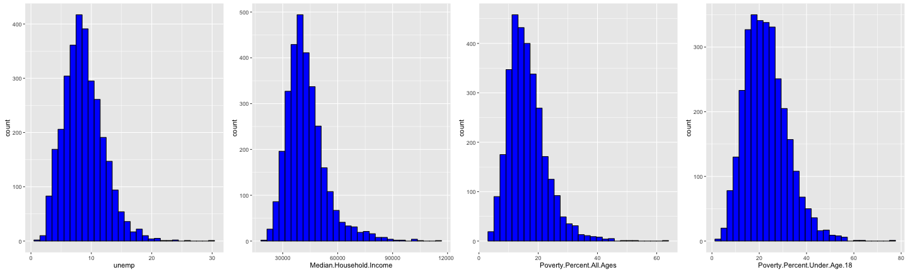
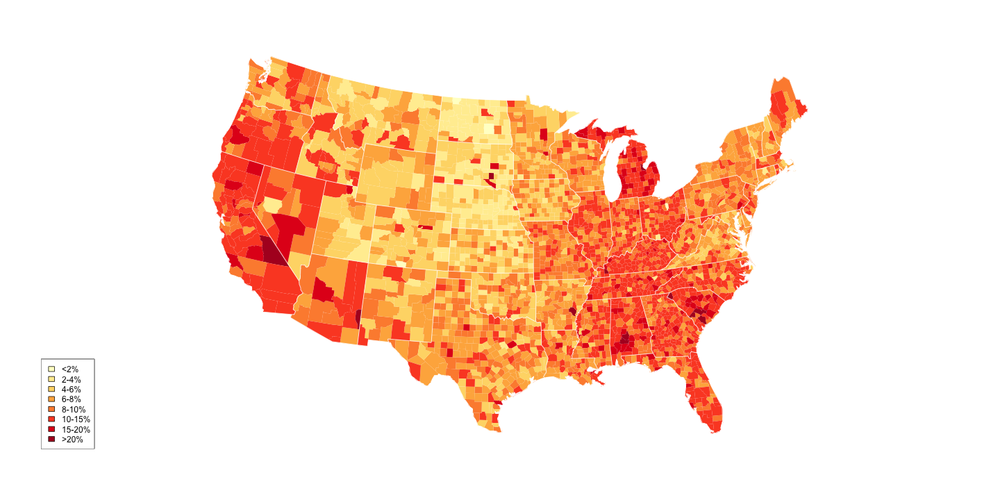
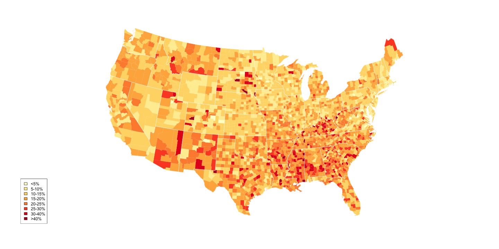

## The Data
1. County level unemployment rate, poverty rate and median income level data in 2009
2. Poverty rate include Poverty rate among all, poverty rate among under 18, and poverty rate among age 5 to 17.
3. Median household income in each county.



---
## Data Pre-Process
1. Categorize the continuous numerical measures. Assign each category a color.
2. Visualize the numerical measures on a map by giving a area a color matching the numerical measurein that area.
3. The color pallete must respresent the meaning of the measure. 
3. Select the number of categories, and the cutoff point with the help of the histogram plot.

```r
PovertyCut <- c(0, 5, 10, 15, 20, 25, 30, 40, 100)
PovertyCutTex <- c("<5%", "5-10%", "10-15%", "15-20%", "20-25%", "25-30%", "30-40%", 
    ">40%")
UnempCut <- c(0, 2, 4, 6, 8, 10, 15, 20, 100)
UnempCutTex <- c("<2%", "2-4%", "4-6%", "6-8%", "8-10%", "10-15%", "15-20%", 
    ">20%")
IncomeCut <- c(10000, 20000, 30000, 35000, 40000, 45000, 50000, 60000, 80000, 
    1e+05, max(mydf$Median.Household.Income))
IncomeCutTex <- c("<$10K", "$10K-20K", "$20K-30K", "$30K-40K", "$40K-50K", "$50K-60K", 
    "$60K-70K", "$70K-80K", "$80K-90K", "$90K-100K", ">$100K")
```

---
## Visualization
See more visualization on the app: https://phoebe3121.shinyapps.io/DevelopingDataProduct/
Visualize the 2009 unemployment rate across the country.



---
## Visualization
See more visualization on the app:https://phoebe3121.shinyapps.io/DevelopingDataProduct/
Visualize 2009 Poverty Rate Across the Country



